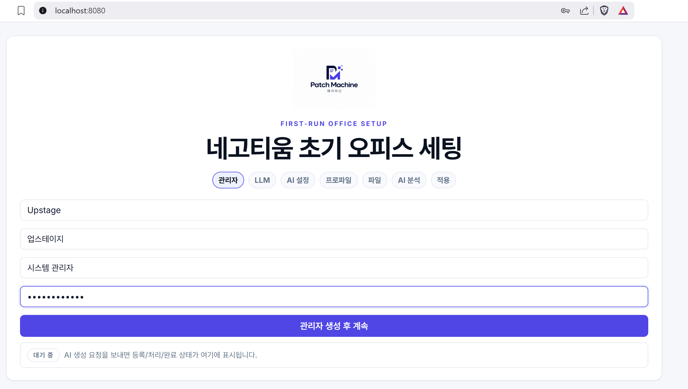
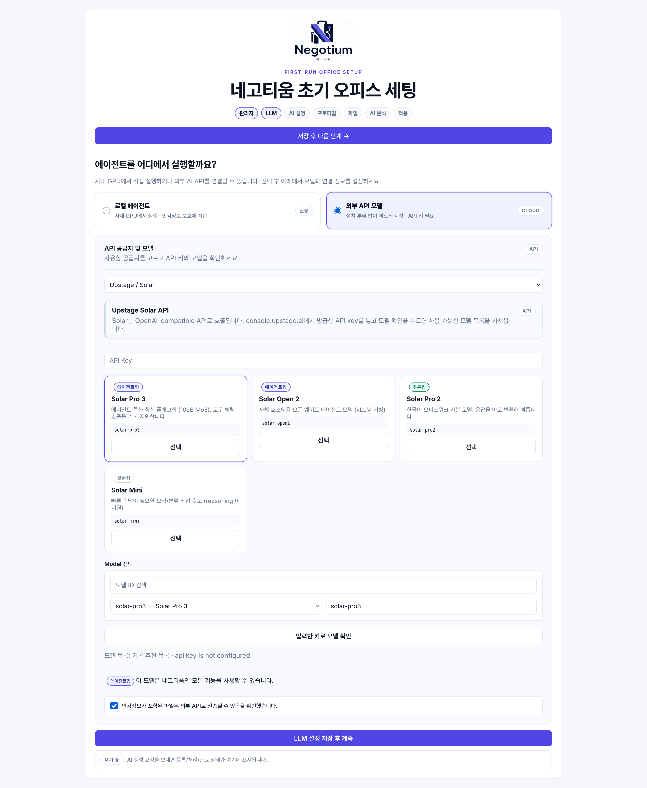
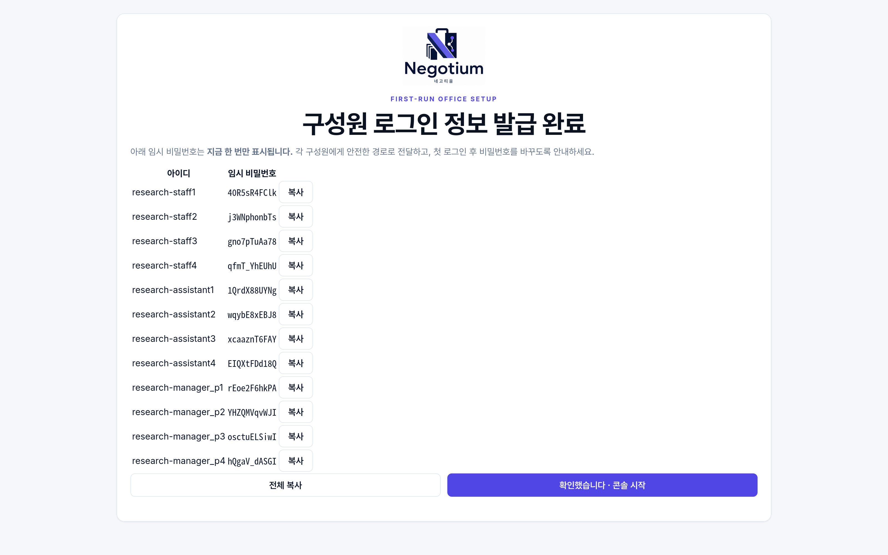
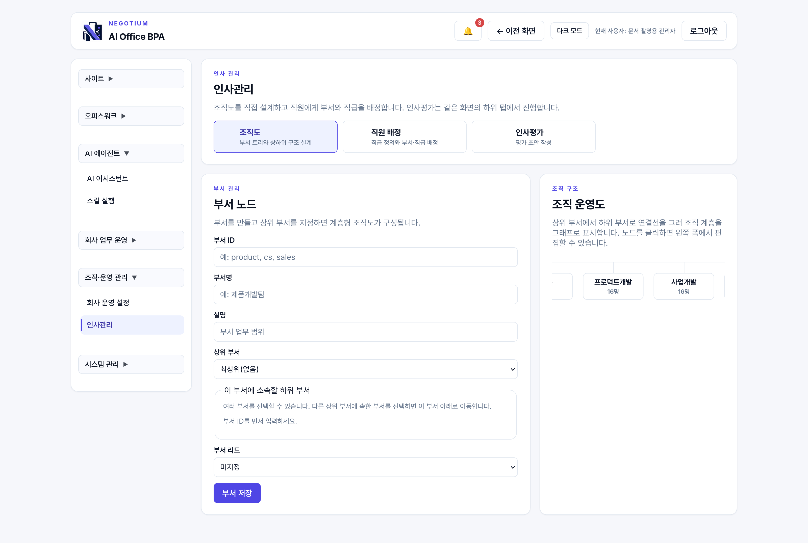
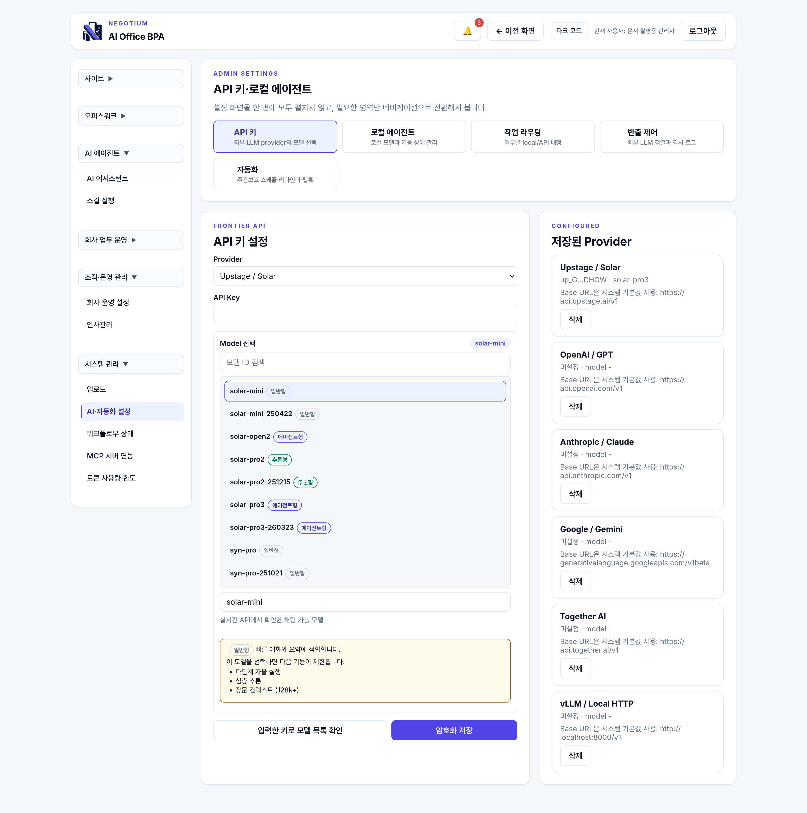
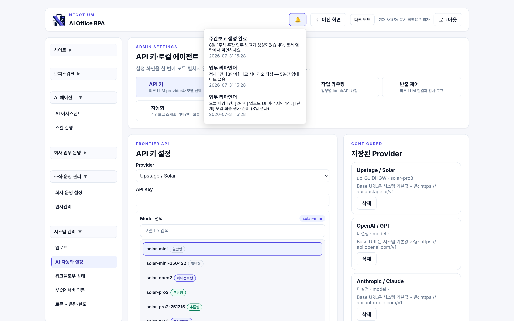
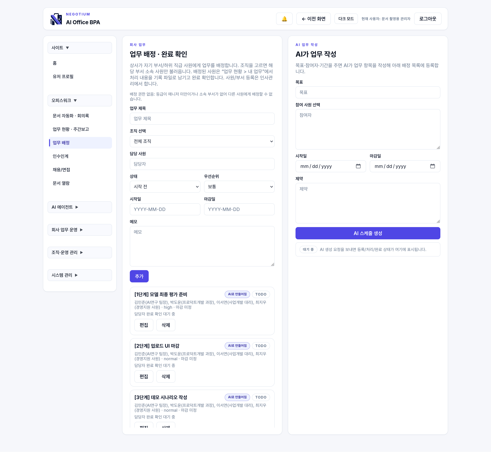
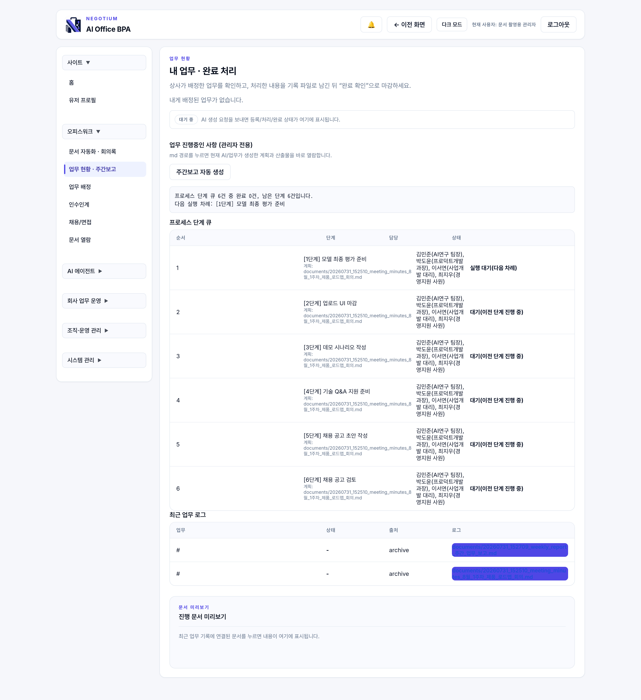
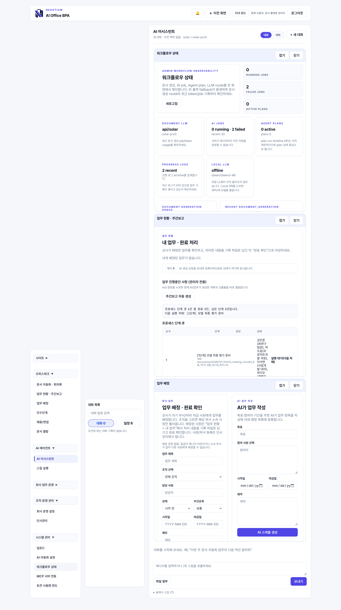
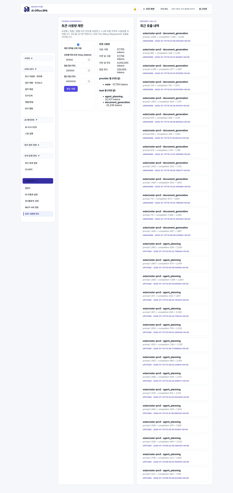

# 관리자 운영 가이드 — 무엇을 어떤 순서로

Negotium을 처음 도입하는 관리자가 **① 무엇을 먼저 설정하고 ② 매일·매주·매월 무엇을 보고
③ 문제가 생기면 어디를 확인하는지** 순서대로 정리한 문서입니다.
콘솔 메뉴 이름은 실제 화면 라벨과 같습니다.

> 📸 표시가 있는 곳은 스크린샷 자리입니다. 캡처한 이미지를 `docs/images/`에 표시된
> 파일명으로 넣고, 바로 아래의 주석 처리된 이미지 줄을 해제하면 됩니다.

---

## 0. 한눈에 보는 운영 리듬

| 주기 | 할 일 | 위치 |
| --- | --- | --- |
| **최초 1회** | 설치 → 관리자 생성 → AI 연결 → 조직 설계 → 구성원 계정 발급 → 자동화·백업 켜기 | 셋업 마법사 + `AI·자동화 설정` |
| **매일 (5분)** | 알림함 확인 → 업무 현황에서 병목 확인 → 회의가 있었으면 회의록 등록 | 🔔 · `업무 현황 · 주간보고` · `문서 자동화 · 회의록` |
| **매주 (15분)** | 주간보고 확인·배포 → 정체 업무 정리 → 신규 계정 요청 승인 | `업무 현황 · 주간보고` · `업무 배정` · `인사관리` |
| **매월 (30분)** | 감사 로그 훑기 → 토큰 사용량·비용 확인 → 백업 이력 확인 → 조직 변경 반영 | `워크플로우 상태` · `토큰 사용량·한도` · `AI·자동화 설정` · `인사관리` |
| **필요할 때** | 인수인계, 채용 킷, 프로세스 설계, 문서 열람 | 해당 메뉴 |

---

## 1. 최초 설정 (이 순서대로)

### 1-1. 서버 실행
```bash
uv venv --python 3.11 .venv && source .venv/bin/activate
uv pip install -e ".[dev]"
cp .env.example .env
negotium serve --build-frontend
```
`http://localhost:8080` 하나만 열면 콘솔과 API가 함께 제공됩니다.
운영 배포라면 `.env`의 `NG_SECRET_KEY`를 충분히 긴 임의 문자열로 **반드시** 직접 설정하세요
(API 키 암호화에 쓰입니다).

### 1-2. 최초 관리자 만들기
첫 화면이 셋업 마법사입니다. 관리자 ID·이름·직함·비밀번호를 입력하면 `owner` 권한 계정이
생기고 바로 로그인됩니다. **이 비밀번호를 분실하면 복구 경로가 없으니** 안전하게 보관하세요.

📸 **스크린샷 ①** `images/01-setup-admin.png` — 셋업 마법사 첫 화면(관리자 생성 폼)
<!--  -->

### 1-3. AI 연결 (Solar 키)
마법사의 LLM 단계에서 Upstage Solar 키를 입력합니다
([console.upstage.ai](https://console.upstage.ai)에서 발급, 기본 모델 `solar-pro3`).
- 키를 넣으면 마법사가 **대화형**으로 조직 설계를 도와줍니다.
- 키가 없어도 콘솔은 모두 열리고, AI 생성 부분만 안내 문구로 대체됩니다. 나중에
  `AI·자동화 설정 → API 키`에서 넣어도 됩니다.
- 사내 민감 문서를 외부로 보내지 않으려면 로컬 모델(vLLM) 라우트를 쓸 수 있습니다
  (GPU 필요, README의 vLLM 절 참고).

📸 **스크린샷 ②** `images/02-setup-llm.png` — 마법사 LLM 단계(Solar 선택 + 모델 티어 표시 상태)
<!--  -->

### 1-4. 회사 정보와 조직 설계
마법사가 회사 프로필 → (선택) 기존 문서 업로드 → 분석 → 검토 순서로 안내합니다.
검토 화면에서 만들 조직·구성원을 확인하고 적용하면, **구성원별 임시 비밀번호가 한 번만
표시됩니다** — 복사해서 각자에게 안전하게 전달하고, 첫 로그인 후 변경하도록 안내하세요.

📸 **스크린샷 ③** `images/03-setup-credentials.png` — 적용 직후 임시 비밀번호 패널("지금 한 번만 표시" 경고 포함)


이후 조직을 바꿀 때는 `인사관리`에서:
1. **부서** 만들기 (상위 부서를 지정해 계층 구조로)
2. **직급** 만들기 — 이때 그 직급이 가질 **권한**을 함께 정의합니다
3. **직원**에게 부서·직급 배정 (권한은 직급에서 자동으로 따라옵니다)

> Negotium은 "사람에게 권한을 주는" 방식이 아니라 **직급에 권한을 정의하고 사람에게 직급을
> 주는** 방식입니다. 신입이 들어올 때마다 권한을 고민할 필요가 없습니다.

📸 **스크린샷 ④** `images/04-personnel.png` — 인사관리 화면(부서 계층 + 직급의 권한 편집이 함께 보이게)


### 1-5. 회사 운영 정보 입력
`회사 운영 설정`에서 회사명·핵심 업무 흐름·사용 도구·민감정보 정책을 저장합니다.
이 내용은 **모든 문서 생성과 업무 배정 프롬프트에 회사 컨텍스트로 자동 전달**되므로,
여기를 채우면 AI 결과물의 품질이 눈에 띄게 올라갑니다.

### 1-6. 자동화와 백업 켜기 (권장)
`AI·자동화 설정 → 자동화`에서:
- **주간보고 자동 생성**: 요일·시각 지정 (예: 금요일 17:00)
- **업무 리마인더**: 매일 시각 + 정체 기준 일수 (예: 09:30, 3일)
- **아카이브 백업 (git)**: 켜두면 문서 변경 이력이 남아 실수 복구가 가능합니다 — **가장 먼저 켜세요**
- **웹훅** (선택): 카카오워크·슬랙 등의 수신 URL을 넣으면 콘솔을 안 봐도 알림이 갑니다
- **시맨틱 검색** (선택): 켜면 문서 조각이 Upstage 임베딩 API로 전송됩니다(과금). 방화벽을
  통과한 조각만 나가지만, 민감도가 높은 회사는 꺼둔 채 키워드 검색만 써도 충분합니다

📸 **스크린샷 ⑤** `images/05-automation.png` — AI·자동화 설정 → 자동화 섹션(주간보고·리마인더·백업·웹훅이 한 화면에)


---

## 2. 매일 (5분)

1. **알림함 🔔** — 상단 벨을 확인합니다. 주간보고 생성 알림, 담당자별 업무 리마인더가 쌓입니다.

   📸 **스크린샷 ⑥** `images/06-notifications.png` — 알림 벨 드롭다운(리마인더 알림이 쌓인 상태)
   
2. **`업무 현황 · 주간보고`** — 진행/완료/병목을 한 화면에서 봅니다. 빨간 항목(마감 초과)이
   있으면 담당자에게 확인하세요.
3. **회의가 있었다면 `문서 자동화 · 회의록`** — 회의 메모를 붙여넣고 "액션 아이템을 업무로
   등록"을 켜면 담당자·순서·의존성이 붙은 업무가 자동 등록됩니다.
   한글(HWP)·워드 파일도 첨부할 수 있습니다.

   📸 **스크린샷 ⑦** `images/07-minutes-to-tasks.png` — 회의록 생성 결과 + 업무 배정에 자동 등록된 항목 (제품의 핵심 장면이므로 가장 공들여 찍을 것)
   

---

## 3. 매주 (15분)

1. **주간보고 확인** — 자동 생성을 켰다면 알림함에 보고서가 와 있습니다.
   `업무 현황 · 주간보고`에서 내용을 확인하고 필요하면 수동으로 재생성합니다.
   생성된 문서는 `문서 열람`에서 언제든 다시 볼 수 있습니다.

   📸 **스크린샷 ⑧** `images/08-weekly-report.png` — 업무 현황 화면 + 생성된 주간보고
   
2. **`업무 배정` 정리** — 완료된 업무 상태 갱신, 정체 업무 재배정, 새 업무 추가.
3. **계정 요청 승인** — 직원이 직접 계정을 신청했다면 `인사관리`에서 승인/거절합니다.
4. **담당자 변경이 있으면 `인수인계`** — 떠나는 담당자를 지정하면 그 사람의 업무 기록을 모아
   인수인계 문서를 만들고, 후속 업무를 새 담당자에게 배정합니다.

---

## 4. 매월 (30분)

1. **`워크플로우 상태`** — 최근 감사 로그를 훑습니다. 누가 무엇을 바꿨는지(관리자 변경,
   API 키 변경, 문서 생성, 계정 승인) 모두 기록됩니다. 예상 못 한 행위가 있는지 확인하세요.

   📸 **스크린샷 ⑨** `images/09-audit-log.png` — 워크플로우 상태의 감사 로그 목록
   
2. **`토큰 사용량·한도`** — AI 호출량과 비용 추이를 봅니다. 과다 사용이 보이면 한도를
   설정하거나, `AI·자동화 설정 → 작업 라우팅`에서 일부 작업을 저렴한 모델/로컬로 돌립니다.

   📸 **스크린샷 ⑩** `images/10-token-usage.png` — 토큰 사용량 화면(사용 이력이 있는 상태)
   
3. **백업 이력 확인** — `AI·자동화 설정 → 자동화`의 아카이브 백업 상태 줄에서 커밋 수와
   마지막 커밋 시각을 확인합니다. 서버에서 직접 이력을 보려면:
   ```bash
   git -C archive log --oneline | head -20
   ```
4. **조직 변경 반영** — 입·퇴사, 부서 개편을 `인사관리`에 반영합니다.
   퇴사자는 계정을 삭제하면 진행 중인 세션도 함께 무효화됩니다.
5. **채용이 있으면 `채용/면접`** — 직무 요구사항·면접 질문·온보딩 계획을 생성합니다.

---

## 5. 문제가 생겼을 때 어디를 보는가

| 증상 | 확인 순서 |
| --- | --- |
| AI 응답이 안 옴 / 오류 | `AI·자동화 설정 → API 키`에서 키가 저장돼 있는지 → "모델 목록 확인"으로 연결 테스트 → `토큰 사용량·한도`에서 한도 초과 여부 |
| 문서 생성이 안내 문구로만 나옴 | AI 키 미설정 또는 호출 실패 상태입니다. 위와 같은 순서로 확인하세요 (실패해도 시스템은 멈추지 않고 빈 문서 틀만 만들어 둡니다) |
| 첨부한 한글/워드 파일 내용이 반영 안 됨 | 채팅·문서 화면의 첨부 비고 메시지를 확인. 클라우드 라우트 + Solar 키가 있으면 표·서식까지, 없으면 텍스트만 추출됩니다 |
| 예전 문서를 못 찾음 | `AI 어시스턴트`에 자연어로 질문해 보세요(아카이브 전체를 검색합니다). 색인이 이상하면 `AI·자동화 설정 → 자동화`의 "지금 재색인" |
| 로그인이 안 됨 | 5회 실패하면 5분간 잠깁니다 — 잠시 후 재시도. 비밀번호 분실 시 관리자가 `인사관리`에서 계정을 다시 발급 |
| 실수로 문서를 지웠음 | 백업을 켰다면 `git -C archive log`에서 이전 커밋을 찾아 복구 (`git -C archive show <커밋>:경로`) |
| 자동화가 안 돌아감 | 해당 작업이 켜져 있는지 → "지금 실행"으로 수동 테스트 → 실패 사유는 `워크플로우 상태` 감사 로그에 기록됩니다 |

---

## 6. 안전 수칙 (꼭 지켜야 할 것)

1. **`NG_SECRET_KEY`와 관리자 비밀번호를 안전하게 보관** — 분실 시 복구 경로가 없습니다.
2. **`archive/` 디렉터리가 회사의 모든 데이터입니다.** 서버 백업 대상에 반드시 포함하세요.
   git 백업을 켜고 사설 원격 저장소까지 설정하면 디스크 장애에도 대비됩니다.
3. **`negotium reset-state`는 모든 데이터를 삭제합니다** (백업 git 이력까지). 실수 방지를 위해
   `--yes` 플래그가 없으면 거부되도록 만들어져 있습니다. 자세한 내용은
   [운영 가이드](operations.md)를 보세요.
4. **외부로 나가는 데이터를 통제하려면** `AI·자동화 설정 → 반출 제어`에서 마스킹·차단 기록을
   확인하세요. 주민등록번호·계좌·비밀키는 자동으로 가려지고 감사 로그에 남습니다.
5. **웹훅·백업 원격 URL에는 토큰이 포함될 수 있습니다.** 사설 저장소·사내 채널만 쓰고,
   URL을 외부에 공유하지 마세요 (시스템은 이 URL을 로그에 남기지 않습니다).

---

## 7. 권한 요약 (누가 무엇을 볼 수 있나)

기본 역할은 `owner`(전체) · `manager`(메모리·문서·업무) · `staff`(채팅·업로드·업무 조회) ·
`viewer`(업무 조회)입니다. 실제 접근은 **직원에게 배정된 직급의 권한 목록**으로 결정되며,
부서별 예외는 `인사관리`에서 조정합니다.

| 메뉴 | 필요 권한 |
| --- | --- |
| 업무 배정 · 프로세스 설계 · 네고티움 메모리 · 회사 운영 설정 | `memory:write` |
| 문서 열람 | `documents:read` |
| AI 어시스턴트 | `llm:chat` |
| 인사관리 · 워크플로우 상태 | `admin:users` |
| AI·자동화 설정 | `admin:api_keys` (자동화·백업 API는 `admin:integrations`) |
| 토큰 사용량·한도 | `admin:token_limits` |
| MCP 서버 연동 | `admin:mcp` |
| 업로드 | `uploads:write` |

---

관련 문서: [운영 상세(초기화·저장 위치·마이그레이션)](operations.md) ·
[아키텍처](architecture.md) · [로드맵](ROADMAP.md)
