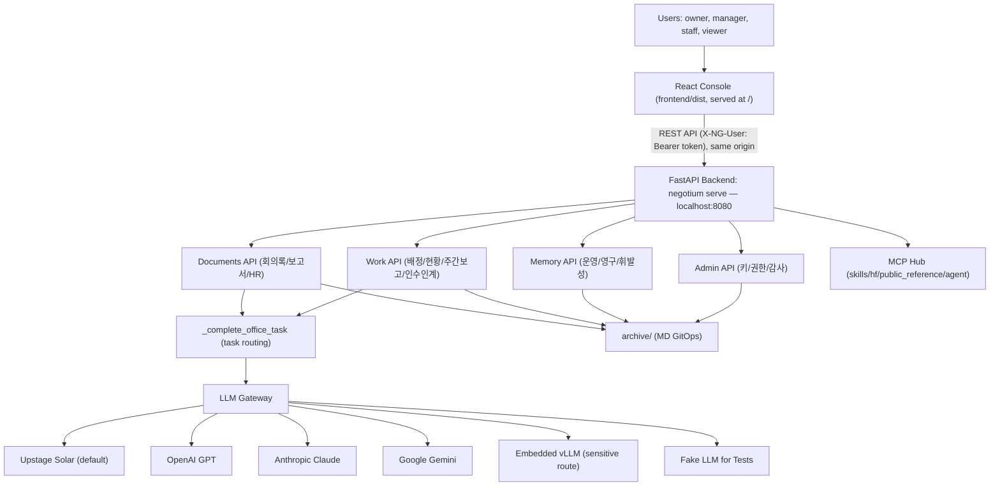
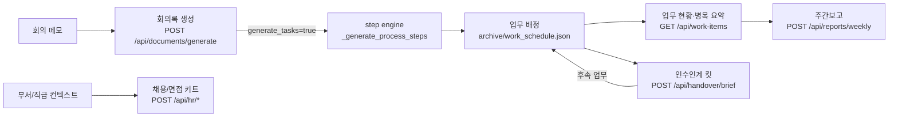
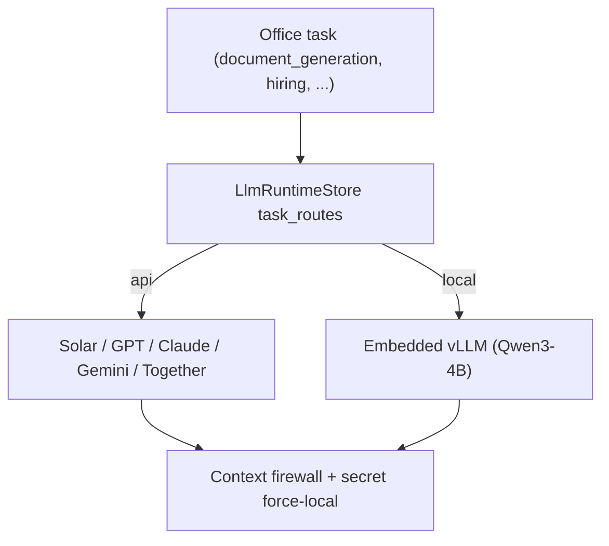
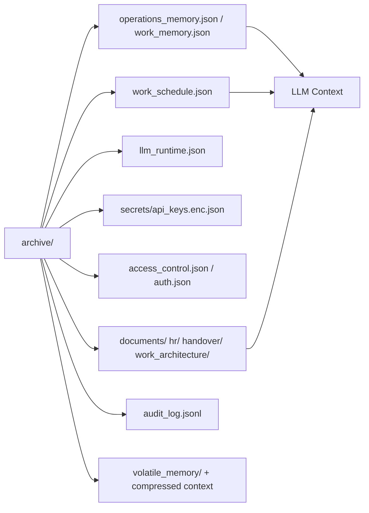
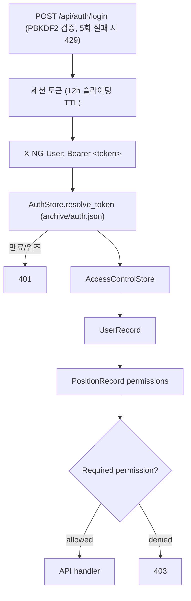
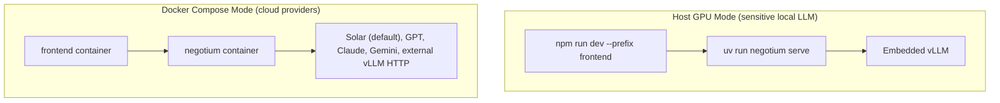

# Negotium Architecture

Negotium is an AI office-work / BPA system: a React console + FastAPI backend with
local/cloud LLM routing over a Markdown-first archive (no database).

## 1. System Overview



## 2. Core Office Loop



## 3. LLM Task Routing

All office completions funnel through `_complete_office_task`, routed per task
(`memory_summary, agent_planning, document_generation, hiring, handover, chat`)
via `archive/llm_runtime.json` — each task can pin a provider/model, and the
route degrades gracefully (empty-response fallback keeps demos alive).



## 4. Archive and Persistence



All stores share the locked-file helpers in `negotium/archive/_store.py`
(portalocker + UTF-8 JSON/JSONL).

## 5. Access Control



비밀번호는 PBKDF2-SHA256(20만 회) 해시로, 세션 토큰은 SHA-256 해시로만
`archive/auth.json`에 저장됩니다. 유효 권한은 직급(position) → 부서 정책 → 역할(role)
순으로 해석되며, `/auth/me`가 반환하는 권한 목록도 동일한 규칙을 따릅니다.

Default roles: `owner` (all via `*`), `manager` (memory/LLM/documents/uploads/work),
`staff` (LLM chat/uploads/work read), `viewer` (work read only). Day-to-day access
is position-centric: a user's assigned position carries the permission list.

## 6. Deployment Shape



Recommended local GPU mode:

```bash
NG_LLM_PROVIDER=vllm \
NG_LLM_DEFAULT_ROUTE=local \
NG_VLLM_MODE=embedded \
NG_VLLM_PRELOAD_ON_STARTUP=true \
uv run negotium serve
```

Docker mode is for the frontend and non-GPU backend operation; it does not load
the embedded local GPU model.
